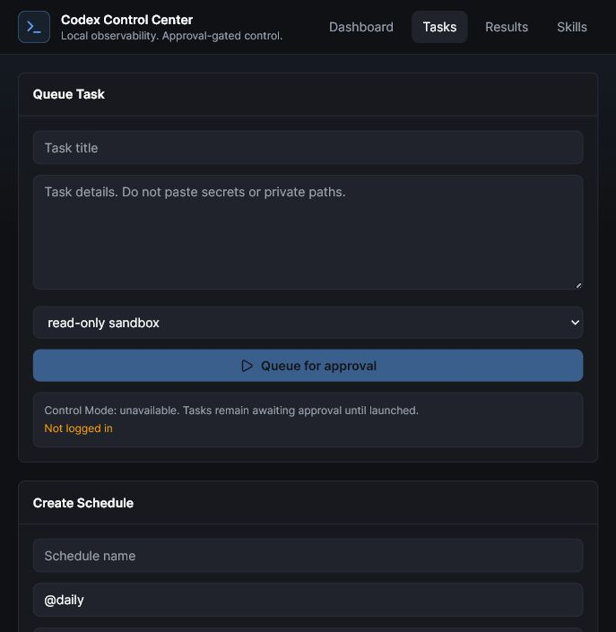
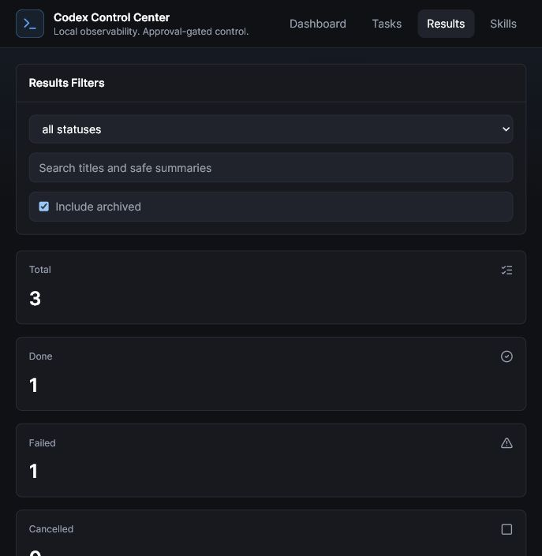
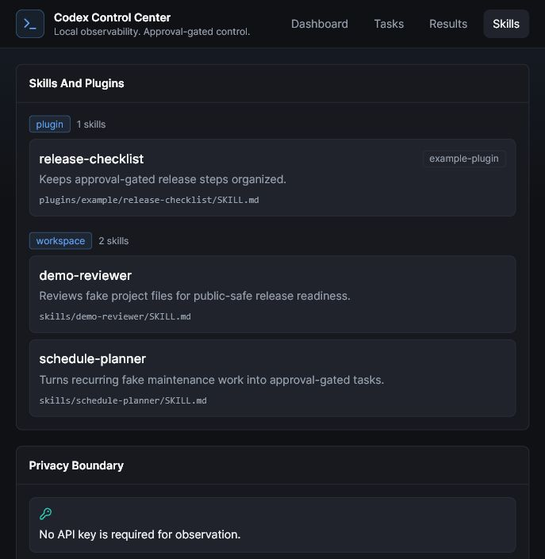

# Codex Control Center

Local observability and approval-gated control for Codex.

**No API key required for local observation.** The dashboard reads local Codex
metadata, local session JSONL files, skills/plugins metadata, schedules, and
optional local OTel events. It never reads or stores `auth.json`, and it binds
to `127.0.0.1` for local-only use.

## Screenshots

These screenshots use fake demo data only.








## Interactive Demo

A public-safe self-playing HTML demo is available at
[`demo/index.html`](demo/index.html). It uses fake dashboard data and does not
connect to Codex, read local files, call OpenAI, publish anything, or reveal
private paths. The included demo music is owner-created by JQAI Systems.

Companion video scripts, storyboards, and HyperFrames source projects live in
[`docs/video/`](docs/video/) for the launch presentation, practical tutorial,
and browser walkthrough. Rendered MP4 drafts stay local in `video-output/`
until they are reviewed and intentionally uploaded elsewhere.

## What It Shows

- System Health: Codex CLI status, local session coverage, last sync, OTel
  state, database label, and privacy posture.
- Usage Remaining: best-effort local usage metadata parsed from Codex
  `token_count` events with `payload.rate_limits`.
- Today Activity: sessions, token totals, tool counts, recent sessions, and top
  tools from local metadata.
- Tasks: approval-gated task queue for dashboard-launched `codex exec --json`
  runs.
- Schedules: local schedule definitions that materialize due work into
  approval-gated tasks only.
- Results: searchable run history with safe output summaries, durations, event
  counts, tool counts, exit codes, and sanitized failure reasons.
- Skills: discovered local Codex skills and plugin-provided skills.

## Modes

- Observe Mode: works without an API key and does not call OpenAI.
- Control Mode: launches approved tasks through your installed
  `codex exec --json --ephemeral`. If Codex is signed in with ChatGPT, this does
  not require an API key.

## Quick Start

Tested on Windows 11. Windows is the primary supported setup for V1; macOS and
Linux may work but are not fully tested yet.

Windows launcher:

```powershell
cd codex-control-center
.\start-control-center.ps1
```

The launcher creates a local Python virtual environment if needed, installs
missing dependencies, builds the React UI when `ui/dist` is missing, starts the
backend on `127.0.0.1:8765`, waits for `/api/health`, and opens the browser.

Useful launcher options:

```powershell
.\start-control-center.ps1 -NoBrowser
.\start-control-center.ps1 -Rebuild
.\start-control-center.ps1 -Install
.\start-control-center.ps1 -Foreground
.\start-control-center.ps1 -StopExisting
```

Manual setup:

```powershell
cd codex-control-center
python -m venv .venv
.\.venv\Scripts\Activate.ps1
pip install -r requirements.txt
cd ui
npm install
npm run build
cd ..
python -m backend
```

Open `http://127.0.0.1:8765`.

For frontend development:

```powershell
cd codex-control-center
python -m backend
cd ui
npm run dev
```

Open `http://127.0.0.1:5173`.

## Privacy Defaults

- Metadata-only ingestion is enabled by default.
- Prompt text and assistant output from local Codex sessions are not stored.
- Raw local paths are redacted to project basename plus a stable local hash.
- The backend never reads `~/.codex/auth.json`.
- The dashboard does not call OpenAI directly.
- Mutating endpoints are loopback-only unless `CCC_CONTROL_TOKEN` is set.
- Task execution output is reduced to redacted summaries and metadata.

## Task Safety

- New tasks start as `awaiting_approval`.
- Default sandbox is `read-only`.
- `workspace-write` must be selected explicitly.
- `danger-full-access` is blocked in V1.
- Schedules only create approval-gated tasks; they do not auto-run Codex.
- Emergency stop only targets dashboard-launched child processes.

For starter prompts and a safe task-writing flow, see
[`docs/task_templates.md`](docs/task_templates.md).

## Video Kit

Public-safe launch and tutorial video scripts live in
[`docs/video/`](docs/video/), including the launch presentation, practical
tutorial, and browser walkthrough. Rendered videos should stay local in
`video-output/` unless they are intentionally reviewed and uploaded.

## Optional OTel

Codex OTel is optional. The dashboard works from local session files without it.
To see a local-only config block:

```powershell
.\scripts\setup_otel.ps1
```

Review the output before adding it to your Codex config.

## Public Publishing Safety

This folder is the public candidate. Do not publish raw Codex session files,
databases, `.env`, logs, private screenshots, local paths, prompts, or account
data.

Run before committing or pushing:

```powershell
python scripts/public_safety_scan.py .
git status --short
git diff
```
